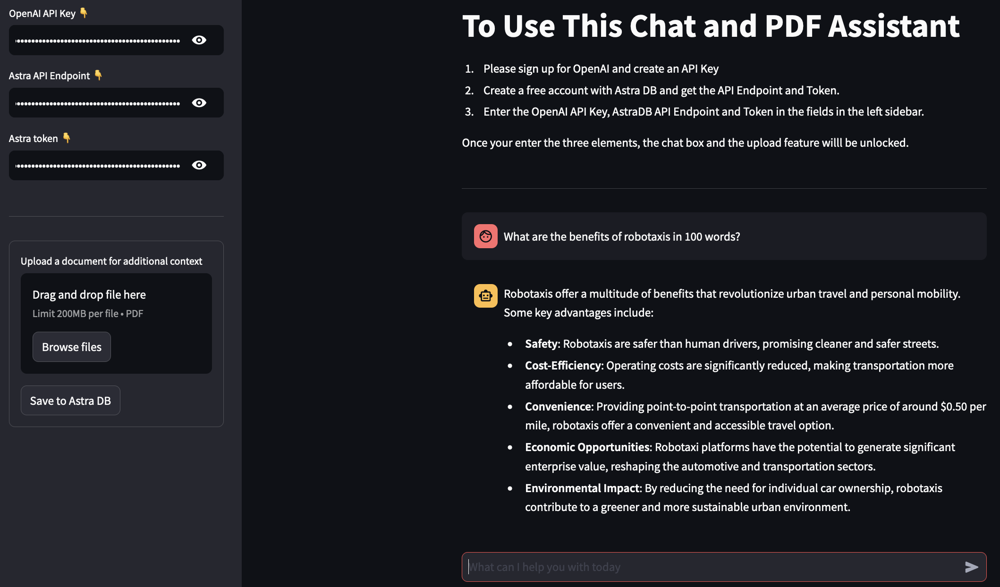

# Building a RAG Chatbot

## About this app

This application is designed to assist users in answering questions and providing additional context through uploaded PDF documents. It leverages OpenAI's powerful language models for generating responses, and Astra DB as a vector store for efficient text retrieval (i.e. Retrieval-Augmented Generation).

This app has been delpoyed to Streamlit so it can be tested live, and it can be set up to run locally. Instructions for both methods are shown below.



## Features

- **Chat with AI**: Ask any question you have and get a detailed answer from our AI assistant.
- **Upload PDF Documents**: Upload documents to make them available as additional sources of specialized information for your queries. The application splits the document into pages, vectorizes each page, and stores it in Astra DB.

## Requirements to Run the App

1. Sign up for OpenAI and create an API Key.
2. Create a free account with Astra DB and get the API Endpoint and Token.
3. Enter the OpenAI API Key, AstraDB API Endpoint and Token in the fields in the left sidebar.

## Required Technologies and Libraries

```
Python
OpenAI
Streamlit
AstraDB
Langchain
Pypdf
```

## How to Use This Chat and PDF Assistant

### 1. Use Live

You can run this now here: https://streamlit

### 2. Set up for Running the App Locally

### Deployment Instructions

- It's useful to create a _Virtual Environment_ when running locally:

```
python3 -m venv myenv
```

- Then activate it as follows:

```
source myenv/bin/activate   # on Linux/Mac
myenv\Scripts\activate.bat  # on Windows
```

- Install all requisite packages:

```
pip3 install -r requirements.txt
```

- Run it with:

```bash
streamlit run rag_pdf_app.py
```

- The app will launched locally at:

```
http://localhost:8501
```
